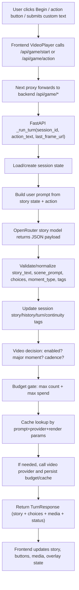

# AI Time-Travel Explorer - Context Index

Use this index together with [CONTEXT_PACK.md](/Users/emilvierinen/Documents/ai%20ai%20game/CONTEXT_PACK.md) when handing the project to another model.

## 1) System Overview
- Frontend: Next.js UI renders scene media, story text, and action controls.
- Proxy: Next API route forwards `/api/game/*` to FastAPI backend.
- Backend: FastAPI orchestrates story generation, state updates, optional video generation, and budget/cache controls.
- AI providers:
  - Story + initial keyframe: OpenRouter (`/chat/completions`)
  - Optional video: Replicate/fal providers via `video_provider.py`

## 2) End-to-End Flow


## 3) Generation Guidance (Prompts + Contracts)
- Prompt source: [backend/prompts.py](/Users/emilvierinen/Documents/ai%20ai%20game/backend/prompts.py)
- Story contract expected from LLM:
  - `story_text: string`
  - `choices: string[]` (target 3 short actions)
  - `scene_prompt: string`
  - `visual_continuity_tags: string[]`
  - `moment_type: normal | milestone | climax | ending`
- Enforced via:
  - `response_format: json_object`
  - JSON parse + normalization + fallback choices in [backend/services/openrouter.py](/Users/emilvierinen/Documents/ai%20ai%20game/backend/services/openrouter.py)

## 4) Core Decision Points
- Should a video be generated:
  - [backend/services/video_decision.py](/Users/emilvierinen/Documents/ai%20ai%20game/backend/services/video_decision.py)
  - Inputs: `moment_type`, `turn_index`, env config
- Is video allowed by budget:
  - [backend/services/video_budget.py](/Users/emilvierinen/Documents/ai%20ai%20game/backend/services/video_budget.py)
  - Gates: max videos per session and max estimated spend
- Reuse prior generation:
  - [backend/services/video_cache.py](/Users/emilvierinen/Documents/ai%20ai%20game/backend/services/video_cache.py)
  - Keyed by prompt + provider + dimensions + seconds + fps

## 5) Where Buttons Come From
- LLM returns `choices` in story JSON payload.
- Backend passes `choices` straight through in `TurnResponse`.
- Frontend renders up to 5 chips and sends clicked text as next `action_text`.
- Files:
  - [backend/services/openrouter.py](/Users/emilvierinen/Documents/ai%20ai%20game/backend/services/openrouter.py)
  - [backend/routers/game.py](/Users/emilvierinen/Documents/ai%20ai%20game/backend/routers/game.py)
  - [frontend/components/ActionOverlay.tsx](/Users/emilvierinen/Documents/ai%20ai%20game/frontend/components/ActionOverlay.tsx)
  - [frontend/components/VideoPlayer.tsx](/Users/emilvierinen/Documents/ai%20ai%20game/frontend/components/VideoPlayer.tsx)

## 6) Session State Model
- State schema: [backend/models.py](/Users/emilvierinen/Documents/ai%20ai%20game/backend/models.py)
- Storage: in-memory dictionary + lock, no persistence:
  - [backend/services/game_state.py](/Users/emilvierinen/Documents/ai%20ai%20game/backend/services/game_state.py)

## 7) Runtime Config That Changes Behavior
- Source of env defaults and parsing:
  - [backend/services/video_config.py](/Users/emilvierinen/Documents/ai%20ai%20game/backend/services/video_config.py)
- Env examples:
  - [.env.example](/Users/emilvierinen/Documents/ai%20ai%20game/.env.example)
- High-impact switches:
  - `STORY_MODEL`
  - `ENABLE_VIDEO_GENERATION`
  - `VIDEO_PROVIDER`
  - `VIDEO_MAJOR_MOMENTS_ONLY`
  - `VIDEO_EVERY_N_TURNS`
  - `VIDEO_MAX_PER_SESSION`
  - `VIDEO_MAX_SESSION_SPEND_USD`

## 8) Frontend-Backend Boundary
- Proxy route:
  - [frontend/app/api/game/[...path]/route.ts](/Users/emilvierinen/Documents/ai%20ai%20game/frontend/app/api/game/%5B...path%5D/route.ts)
- Backend API:
  - [backend/routers/game.py](/Users/emilvierinen/Documents/ai%20ai%20game/backend/routers/game.py)
  - `POST /api/game/start`
  - `POST /api/game/action`
  - `GET /api/game/status`

## 9) Suggested Prompt For Another Model
```text
Review this project end-to-end with emphasis on generation logic and UX wiring.
Focus on:
1) how prompts and schema guide outputs,
2) when generations are accepted/rejected,
3) how action buttons are generated and fed back into turns,
4) continuity and state consistency risks,
5) concrete file-level fixes and tests.

Deliver:
- concise architecture summary,
- detailed flow walkthrough,
- severity-ranked risk list,
- specific code edits by file,
- test plan for prompt/output validation and gating logic.
```

## 10) Regenerate Context Pack
```bash
./scripts/build-context-pack.sh
```
